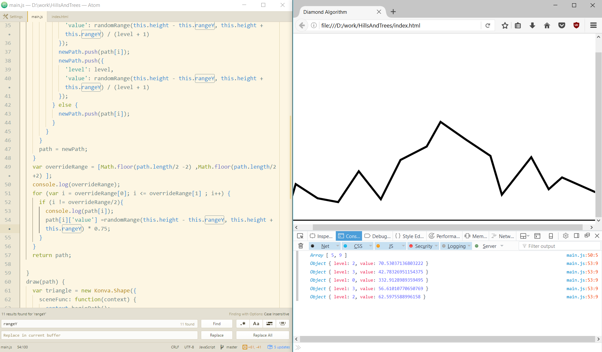
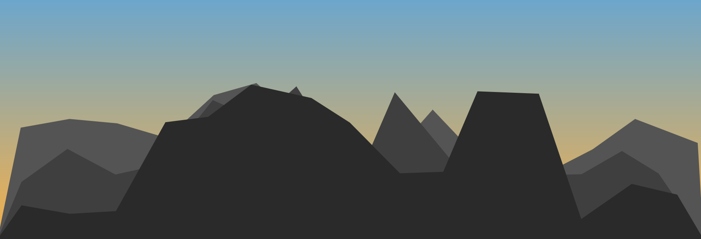

# Simple, yet Good Looking Procedural Generated Hills
My attempt at making procedural hills and mountains. Inspired by 
[Scott Turner's post](https://heredragonsabound.blogspot.md/2016/12/how-to-decorate-mountain-part-2.html).

## **[Try it](https://cubbk.github.io/HillsAndTrees/)**

My progress so far

1. First draw of edges

2. Added gradient sky, multiple lines of hills and painted all in pretty colors taken from [color-hex.com](http://www.color-hex.com/) 

